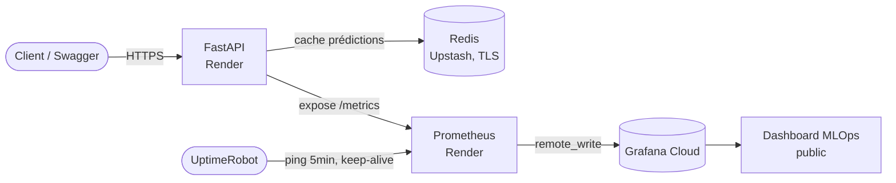
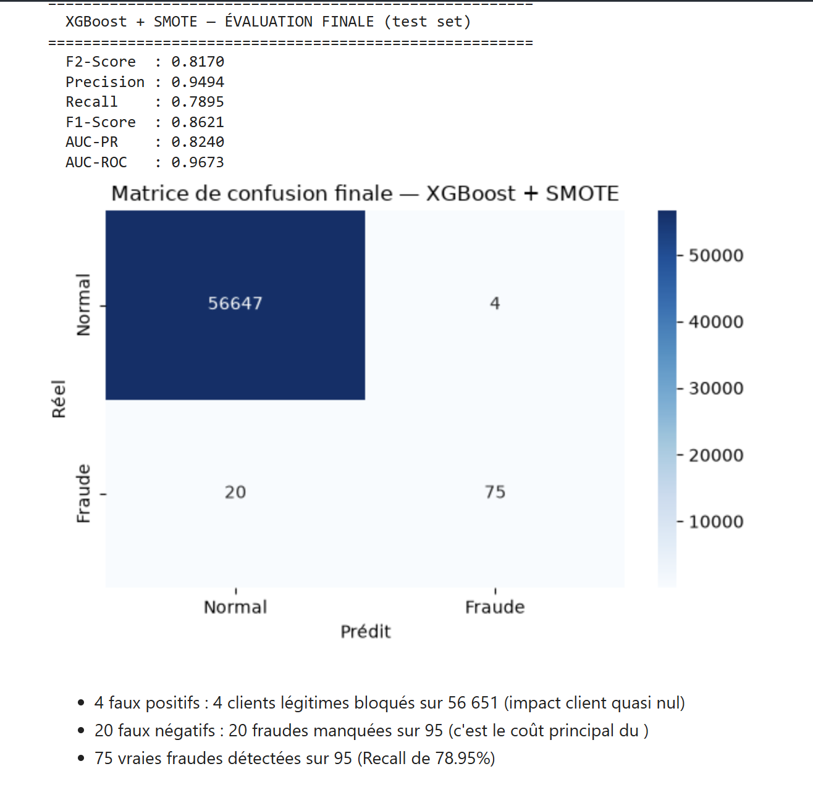
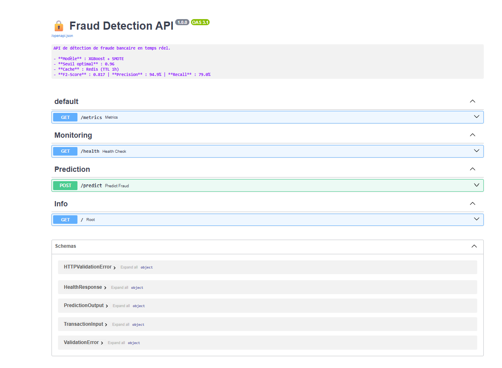
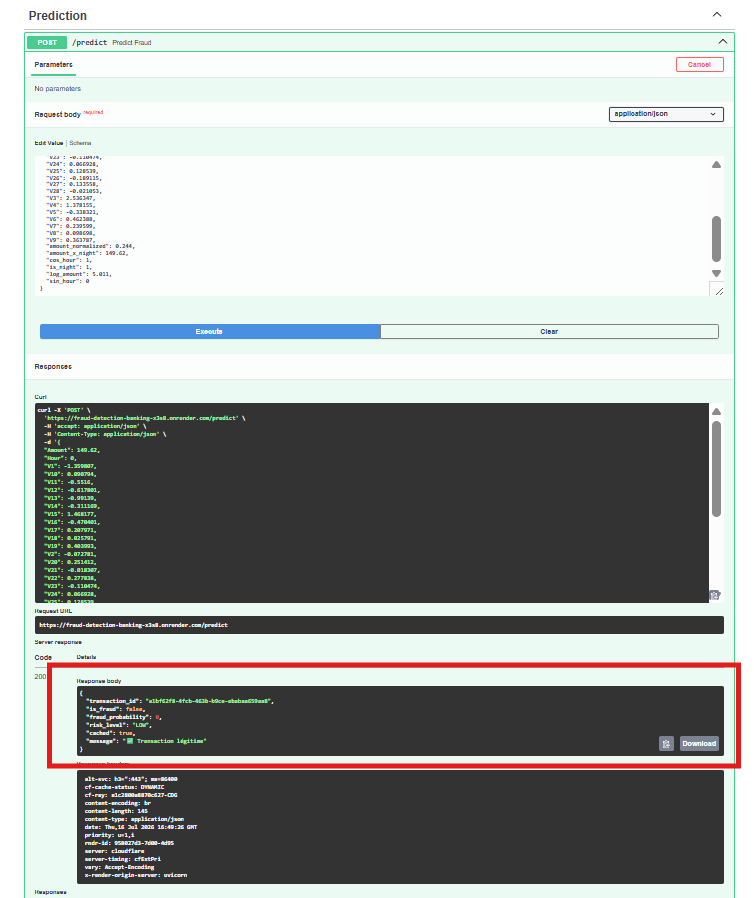
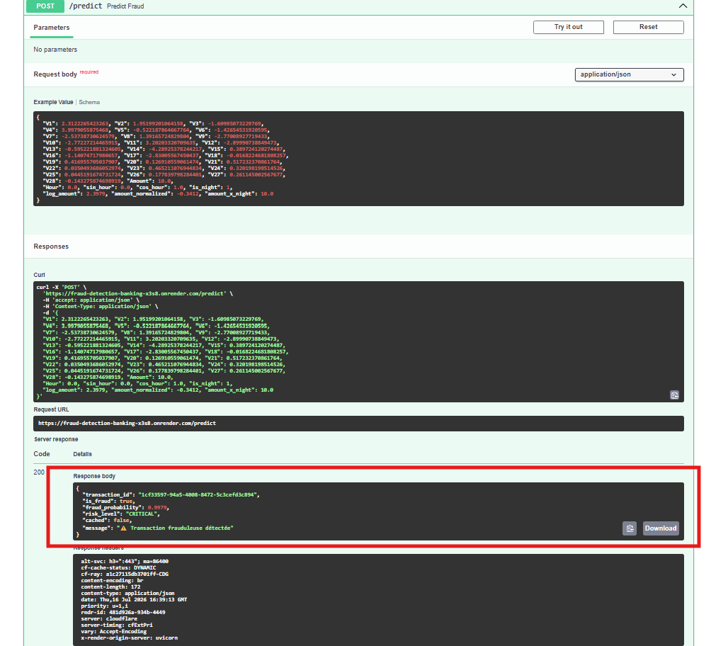
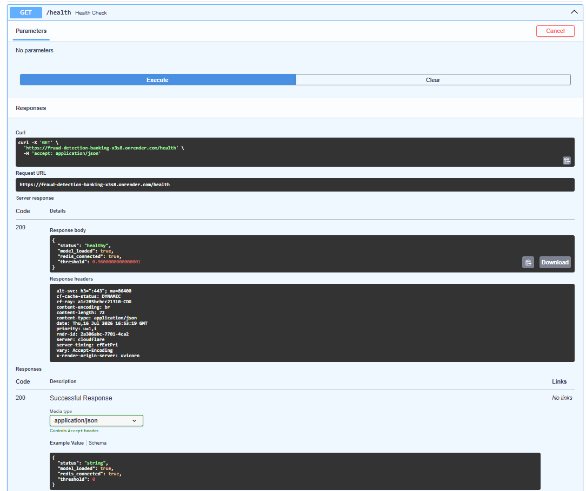
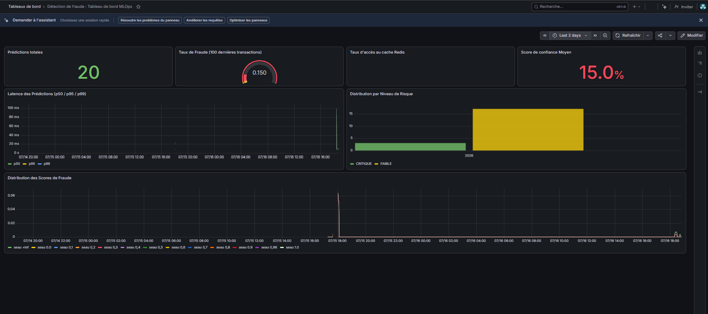
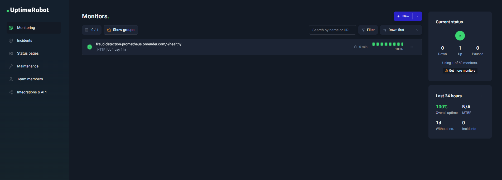

# Fraud Detection Banking : Détection de fraude bancaire en temps réel


Dans ce projet, j'ai construit un système de détection de fraude bancaire en temps réel, du modèle de machine learning jusqu'au déploiement cloud complet avec API, cache distribué et monitoring en production.

---

## Contexte métier

La détection de fraude bancaire est un problème de **classification extrêmement déséquilibrée** : sur les **284 807 transactions** du dataset ([Credit Card Fraud Detection, Kaggle / ULB Machine Learning Group](https://www.kaggle.com/datasets/mlg-ulb/creditcardfraud)), seules **0.172% sont frauduleuses**. Un modèle naïf qui prédit "jamais de fraude" atteindrait 99.8% d'accuracy tout en étant totalement inutile.

L'enjeu ici est de trouver le compromis entre :
- **Rater le moins de fraudes possible** (Recall) : chaque fraude non détectée coûte de l'argent à la banque
- **Ne pas noyer les analystes sous les fausses alertes** (Precision) : chaque faux positif coûte du temps d'investigation humaine

Les features `V1` à `V28` sont issues d'une **PCA appliquée en amont par les auteurs du dataset** (anonymisation des données bancaires réelles) ; seules `Time` et `Amount` sont d'origine.

---

## Architecture



| Composant | Rôle | Hébergement |
|---|---|---|
| **API FastAPI** | Sert les prédictions (`/predict`), expose les métriques (`/metrics`) et le healthcheck (`/health`) | [Render](https://render.com) (Docker, port dynamique) |
| **Redis (Upstash)** | Cache les prédictions pour des transactions identiques (TLS + auth) | [Upstash](https://upstash.com) |
| **Prometheus** | Scrape `/metrics` toutes les 15s et pousse (`remote_write`) vers Grafana Cloud | Render (2ᵉ service Docker) |
| **Grafana Cloud** | Stockage des séries temporelles + dashboard de monitoring | [Grafana Cloud](https://grafana.com) (région EU) |
| **UptimeRobot** | Ping le service Prometheus toutes les 5 min pour contourner la mise en veille du plan Free de Render | [UptimeRobot](https://uptimerobot.com) |

---

## Résultats du modèle

Modèle : **XGBoost + SMOTE** (rééquilibrage de classe), seuil de décision **optimisé sur le set de validation** (et non le set de test, pour éviter le data leakage).

| Métrique | Valeur |
|---|---|
| **Seuil optimal** | 0.96 |
| **Precision** | 94.94% |
| **Recall** | 78.95% |
| **F2-Score** | 0.817 |
| **AUC-ROC** | 0.9673 |

> Le F2-Score (qui pondère le Recall 2× plus que la Precision) a été choisi comme métrique d'optimisation principale car il est cohérent avec l'enjeu métier : mieux vaut quelques fausses alertes qu'une fraude non détectée.



**Feature engineering** (voir [`notebooks/02_feature_engineering.ipynb`](notebooks/02_feature_engineering.ipynb)) : 7 features dérivées créées à partir de `Time` et `Amount` : encodage cyclique de l'heure (`sin_hour`/`cos_hour`), indicateur nuit (`is_night`), log-transformation et normalisation du montant, et une feature d'interaction montant × nuit.

Notebooks complets : [EDA](notebooks/01_EDA.ipynb) · [Feature Engineering](notebooks/02_feature_engineering.ipynb) · [Modeling](notebooks/03_modeling.ipynb)

---

## Stack technique

- **Machine Learning** : XGBoost, scikit-learn, imbalanced-learn (SMOTE), pandas, numpy
- **API** : FastAPI, Pydantic, Uvicorn
- **Cache** : Redis (Upstash, cloud managé, TLS)
- **Monitoring** : Prometheus, Grafana Cloud, `prometheus-fastapi-instrumentator`
- **Déploiement** : Docker, Docker Compose (local), Render (cloud)
- **Observabilité infra** : UptimeRobot (keep-alive + uptime tracking)

---

## Démo live

| Endpoint | Lien |
|---|---|
| 📘 Documentation interactive (Swagger) | [fraud-detection-banking-x3s8.onrender.com/docs](https://fraud-detection-banking-x3s8.onrender.com/docs) |
| ❤️ Healthcheck | [fraud-detection-banking-x3s8.onrender.com/health](https://fraud-detection-banking-x3s8.onrender.com/health) |
| 📈 Dashboard de monitoring (Grafana Cloud, public) | [Fraud Detection : MLOps Dashboard](https://purpleboxwood1448.grafana.net/public-dashboards/892deb5c32fc45a18c7308d69f0e716c) |

> ⚠️ L'API tourne sur le plan gratuit de Render : après 15 min d'inactivité, le premier appel peut prendre 30-60 secondes (cold start) le temps que le service se réveille.

---

## Captures d'écran

**Documentation Swagger**


**Prédiction — transaction légitime**


**Prédiction — transaction frauduleuse**


**Healthcheck**


**Dashboard MLOps (Grafana Cloud)**


**Monitoring d'uptime (UptimeRobot)**


---

## Installation locale

```bash
git clone https://github.com/Dboy003/Fraud-detection-banking.git
cd Fraud-detection-banking
docker-compose up --build
```

Services disponibles en local :
- API : `http://localhost:8000/docs`
- Prometheus : `http://localhost:9090`
- Grafana : `http://localhost:3000`

---

## Structure du projet

```
Fraud-detection-banking/
├── api/
│   ├── main.py              # Endpoints FastAPI (/predict, /health, /metrics)
│   ├── predictor.py          # Chargement du modèle, connexion Redis, métriques Prometheus
│   ├── schemas.py            # Schémas Pydantic (validation des requêtes)
│   └── requirements.txt
├── models/
│   ├── fraud_detection_pipeline.pkl
│   └── model_config.json     # Seuil optimal et métadonnées du modèle
├── monitoring/
│   ├── prometheus.yml        # Config Prometheus (usage local, Docker Compose)
│   ├── prometheus.cloud.yml  # Config Prometheus (remote_write vers Grafana Cloud)
│   ├── Dockerfile            # Image Prometheus dédiée au déploiement Render
│   └── grafana_dashboard.json
├── notebooks/
│   ├── 01_EDA.ipynb
│   ├── 02_feature_engineering.ipynb
│   └── 03_modeling.ipynb
├── Dockerfile                 # Image de l'API FastAPI
├── docker-compose.yml         # Stack complète (API + Redis + Prometheus + Grafana) en local
└── requirements.txt
```

---

## Points techniques notables

Quelques défis réels rencontrés et résolus pendant le déploiement (au-delà du simple `docker build` qui fonctionne du premier coup) :

- **Port dynamique Render** : Render assigne le port via la variable `$PORT` à l'exécution, le `CMD` du Dockerfile lit cette variable dynamiquement (`--port ${PORT:-8000}`) plutôt que de la coder en dur, pour rester compatible avec Docker Compose en local.
- **`.gitignore` trop permissif** : la règle `models/*.pkl`, ajoutée pour éviter de committer de gros fichiers, excluait aussi le modèle entraîné nécessaire en production. L'API crashait au démarrage (`FileNotFoundError`) faute de modèle disponible dans l'image.
- **Secrets et remote_write** : le token Grafana Cloud est injecté via les *Secret Files* de Render (`password_file` dans la config Prometheus) plutôt que codé en dur.
- **Mise en veille du plan Free** : le service Prometheus, qui ne reçoit jamais de trafic HTTP entrant (il *envoie* des données, il n'en *reçoit* pas), se met en veille au bout de 15 min d'inactivité sur Render, un ping externe (UptimeRobot) le maintient éveillé pour garantir un monitoring continu.

---

## 📄 Licence

Ce projet est sous licence [MIT](LICENSE).

---

**Auteur** : [Dboy003](https://github.com/Dboy003)
